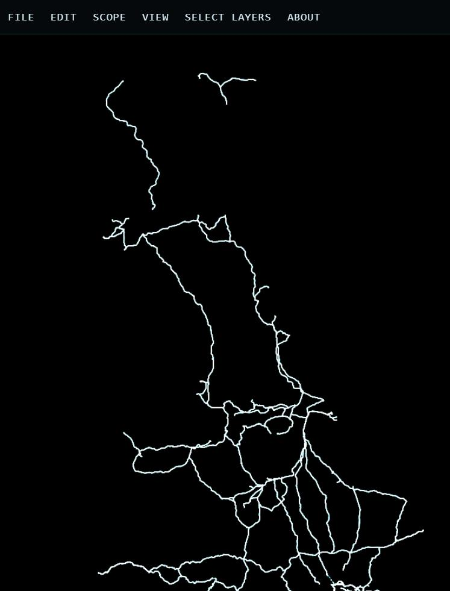
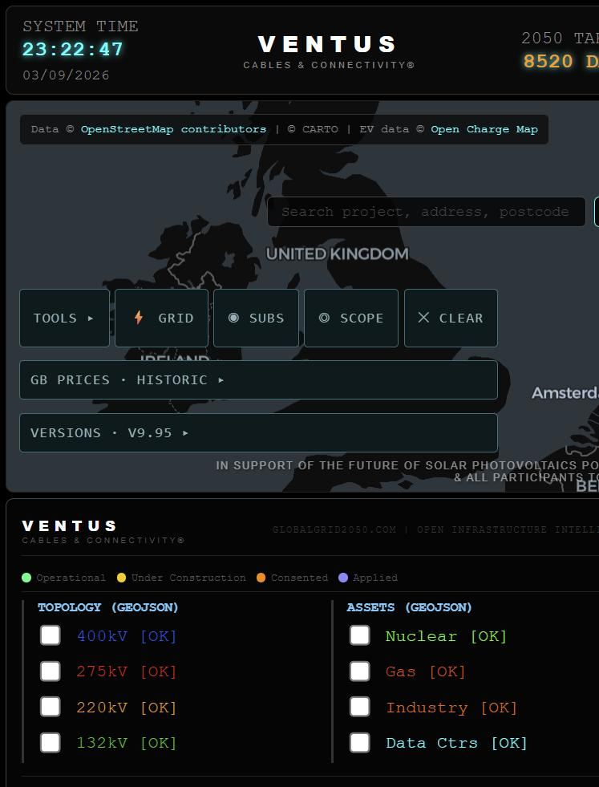

# Menu-bar archaeology — what v9.94 actually shipped, and why the same idea works in the world

> **CORRECTED by `01-CORRECTION.md`.** The at-rest and arrival percentages in section 1
> (66.5 / 54.5 / 16.0 / 13.5) measured a page whose layer key list had not populated and are
> **withdrawn** — do not quote them. Corrected: **40.3% v9.94, 28.4% v9.95** at rest;
> **15.9% / 13.8%** on arrival. Sections 2 and 3 are unaffected.

2026-09-03, ~22:24 UTC. Lane: ARCHAEOLOGY. Five tabs left open in the architect's Chrome.

Everything below names the generation and the bytes it read. Where I could not measure, it says so.

---

## What is open in Chrome, and what each tab actually holds

| tab | what it is | generation actually loaded |
|---|---|---|
| a | `https://ventusltd.github.io/gridatlas/atlas/` | **202609032041** (v9.95) as loaded ~22:05 UTC |
| b | `http://localhost:8912/atlas/` — the menu-bar generation, reconstructed | **202609032012** (v9.94) |
| c | `https://ventusltd.github.io/gridatlas/atlas/world/` | world, live |
| d | `http://localhost:8913/releases/202608291447-pipelinenews/index.html` | 29 Aug — **the generation the live pointer names** |
| e | `http://localhost:8913/releases/202609032159-pipelinenews/index.html` | today, 21:59 |
| + | `http://localhost:8912/probe.html` | 393x852 side-by-side rig (below) |

**Tab (a) is not the newest Atlas.** Pages served `202609032041` when the tab loaded; `atlas/current.json`
on Pages now serves **202609032213** (v9.96, `85497f8`, "the map opens as the first impression, not
behind its own controls"), which landed at 22:16 UTC while this lane was measuring. The tree moved
under me exactly as `CLAUDE.md` warns. Reload tab (a) to see v9.96.

### How tab (b) was reconstructed

The cartridges are immutable files, so nothing had to be rebuilt. A copy of `atlas/` in scratch, with
`current.json` rewritten from `manifests/202609032012-composition.json` — generation and the two
cartridge paths that moved (`sld-sandbox`, `substation-intelligence`); the other two are unchanged
since 30 Aug / 1 Sep. All four cartridges hash-match their manifest entry on disk, so the composer's
own SHA-256 gate passed and the page is the v9.94 composition byte for byte.

One trap on the way: `atlas/releases/202608300453-atlas-v9/index.html` on disk hashes
`9794777c…`, not the manifest's `87a3aaf4…`. It is not corrupt — `git ls-files --eol` says
`i/lf w/crlf`, and the git blob hashes `87a3aaf4…` exactly. The working tree is CRLF, the blob is LF.
The composer does not hash the shell, so it loads; but a checksum comparison against the working tree
would have invented a defect here.

---

## The measurement rig, and one condition I could not meet

**I could not get `document.hidden === false`.** Every tab in the MCP window reports
`hidden: true` with `hasFocus: true` — the signature of a Chrome window fully occluded by another.
The occluding window is another lane's: `GridAtlas — skin architecture prototype`. Per standing
discipline I did not fight it for the foreground. `resize_window` reports success and does not move
the window; a `SetForegroundWindow` P/Invoke was refused by the permission classifier.

So I split the evidence:

- **Layout and hit-testing are valid under occlusion.** Blink lays out and hit-tests a hidden tab
  normally. `getBoundingClientRect`, `offsetParent`, computed style and `elementFromPoint` are sound.
  Every number below comes from these.
- **Painting and frame rate are not valid.** MapLibre stalls and `requestAnimationFrame` is throttled.
  The live world reports `fps 1` in tab (c) — that is the throttle, **not** a performance finding, and
  I am not reporting it as one. Likewise `circuits 0 / carriers 0` in my local world iframe is the
  stall; the live world tab, which had painted, reads `circuits 4,106 · carriers 33,400 · cores 20 ·
  gpu ANGLE`.
- **Click-driven behaviour is not valid.** A backgrounded tab drops clicks on this estate. So
  "SCOPE does not work" was verified **structurally** (it cannot be hit) and not by clicking.

**Getting a true 393x852.** Chrome will not make a window narrow enough — the smallest viewport I
could reach was 548x719, one breakpoint short (`max-width:480px` false). Media queries evaluate
against an **iframe's** own viewport, so `probe.html` hosts three same-origin 393x852 iframes:
v9.94, v9.95, and the world extracted from `f4c2baf` (`git archive`, sha256 `240240692773…`,
byte-identical to the blob — the working-tree `atlas/world/index.html` is mid-edit by another lane
and was not read). In all three, `matchMedia('(max-width:480px)')` is **true**. That is the real
phone layout.

Instrument for "how much map can you see": sample `elementFromPoint` on a 3px grid over the whole
viewport and count the points whose topmost element is the map canvas. That counts occlusion and
z-order, which an area-of-the-container calculation does not.

---

## 1. What the menu bar actually did — the withdrawal note, claim by claim

### VERIFIED — SCOPE and CLEAR measure 0x0

At 393x852 on v9.94, both are `width 0, height 0`, `offsetParent: null`, while computed
`display: block` and `visibility: visible`. They are unreachable, not styled away. Their parentage:

```
button < div#gridatlas-mobile-tray < div.map-controls.gm-tools-collapsed < div#map-container
```

Same for `Tools ▸`, `⚡ Grid`, `◉ Subs`. The tray itself is `display: flex` and measures 0x0 — it is
the ancestor that is hidden, not the buttons.

The source says why, in two lines that never meet:

```js
'.gridatlas-menu-hosted .map-controls{display:none !important}'
```

```js
Array.prototype.slice.call(stack.children).forEach(function (node) {
  var label = node.textContent || node.getAttribute('aria-label') || '';
  var target = panels[routeFor(label)];
  if (!target) return;              //  <- silent skip
  target.appendChild(node);
  moved += 1;
});
```

`adopt()` walks **direct children of `.map-controls`**. `div#gridatlas-mobile-tray` is a div whose
`textContent` is `Tools ▸⚡ Grid◉ Subs◎ Scope✕ Clear`; `routeFor` cannot classify that, `target` is
undefined, and the loop **returns silently**. The tray stays behind — and the very next thing the
module does is hide the container it stayed in.

The comment above the loop reads *"Nested structure is left intact and moved whole, so a control that
is really a group keeps its group."* The group was left intact. It was not moved.

This is the estate's own rule appearing in a UI module: **a missing input must FAIL, never skip.**
`if (!target) return;` is the same shape as the guarded `if (PRODUCT_FILE)` that skipped 675 of 735
checks. Five buttons went to production invisible and nothing raised a hand.

The proof asserted node identity and passed 104/104, because it asserted the nodes that *were* moved.
**A proof can only test what someone thought to assert.**

### VERIFIED — two of four menus shipped reading "nothing here yet"

Measured live on v9.94:

| menu | panel contents |
|---|---|
| File | `⬇ Export CSV` |
| Edit | `nothing here yet` |
| View | `◎ Radius Search`, `◵ Radius Area`, `⬡ Poly Zone`, `◑ Status Colours`, `📏 Measure` |
| About | `nothing here yet` |

The string is generated by the module itself — after `adopt()`, any panel with zero children gets a
`div.gm-empty` reading `nothing here yet`. Half the bar was a placeholder because `routeFor` routed
nothing to it, and the placeholder is what made that acceptable enough to ship.

Note the asymmetry that proves the diagnosis: `◎ Radius Search` and `◵ Radius Area` **did** move —
they are now at `div.gm-panel < div.gm-menu < nav#gridatlas-menu-bar` and measure 0x0 only because
the panel is closed at rest, which is correct. They were direct children. The tray's five were not.

### NOT REPRODUCED — "the map was left 31.7 per cent of a 393x852 screen"

At a true 393x852, at rest, unclicked, visible map by hit-test:

| generation | visible map | biggest non-map consumers |
|---|---|---|
| v9.94 (bar installed) | **66.5%** | `.dashboard` 7.8, `.scada-wrapper` 4.4, `.hud-header` 4.3, `.gm-title` 3.2, `nav#gridatlas-menu-bar` 2.0 |
| v9.95 (bar withdrawn) | **54.5%** | `BUTTON` 11.2, `.scada-wrapper` 6.0, `.hud-header` 4.3, `.custom-map-attrib` 3.3, `.map-controls` 2.0 |

The map container is identical in both — 385.3 x 646.3, 74.4% of the viewport. The whole difference
is overlay. **On my instrument the menu bar gave the map 12 points more screen than the version that
replaced it**, and the entire bar cost 5.2% of the viewport.

I could not reproduce 31.7% at rest. I found where a number of that order lives — the **arrival**
state. Loading the same deep link a reader gets from Pipeline News
(`?project=…&repd_ref=12588&latitude=…&longitude=…&zoom=11`):

| generation | visible map on arrival |
|---|---|
| v9.94 | **16.0%** |
| v9.95 | **13.5%** |

and in **both**, the single largest thing on a phone screen is `P.neon-caveat` at **18.4%** — the
caveat paragraph occupies more of the arrival screen than the map does. `div.search-result-item`
takes another 5% in both, which is the mobile-first spec's P1 (`#search-results` opens on arrival and
is never dismissed), still unfixed and untouched by either generation.

So: 66.5% at rest, 16.0% on arrival, and 31.7% in neither. The **direction** of the withdrawal note
holds — the map is short of screen — but the figure does not reproduce as an at-rest property of
v9.94, and the largest consumer of an arrival screen is not the menu bar.

### COULD NOT CHECK

- **"On desktop they were absent from the DOM entirely."** My desktop viewport was 548x719, which is
  `max-width:600px` true — the mobile branch. I never had a desktop layout to look at.
- **"Radius Search armed correctly and then had nowhere to show its answer."** Arming needs a click,
  and a click needs a foreground tab. Structurally consistent: the result panel is a descendant of
  the same `.map-controls` that is `display:none !important`, so it inherits the tray's fate — but I
  did not see it happen.
- **"Desktop was a genuine improvement — menus exclusive, tools firing."** Same reason.

---

## 2. Why the same idea works in the world — the mechanism

At the same 393x852, the world shows **95.8% map** (94.5% live at 498x654), and the hit-test finds
exactly **three** kinds of element in the whole viewport: `MAP`, `BUTTON.t`, `NAV#bar`. Six menus.
34px of chrome.

It is not restraint or aesthetics. It is two structural facts, and the Atlas has neither.

**One — the bar is a fixed overlay on a fixed map; it is not a tenant in the map's box.**

```css
#map     { position:fixed; inset:0; top:34px; background:#000; }
nav#bar  { position:fixed; top:0; left:0; right:0; height:34px; z-index:40; }
```

The map *is* the document. Nothing is above it or below it in flow, so nothing can push it. In the
Atlas, `nav#gridatlas-menu-bar` is a **child of `div#map-container`**, which is itself the middle
child of `.dashboard`, sandwiched between `.hud-header` (67px) and `.scada-wrapper` (156px). Measured:
the v9.94 bar sits at `top: 119.3` — 119 pixels *below* the top of the screen. It was never a menu bar
at the top of the screen; it was a strip at the top of the map. It could take space **from the map**
and could not take a single pixel from the 223px of header and footer it was brought in to abolish.

**Two — the world's bar owns every node it shows; the Atlas bar borrowed nodes it could not own.**

The world builds its items: `item()`, `toggle()`, `note()` each create an element and
`panels[menu].appendChild(b)`. There is no other owner of their visibility, so closing a menu is a
total and safe operation.

The Atlas bar adopts. Its stated principle — *"a moved node is the same node"* — is exactly right for
keeping handlers and state, and it is what made the retrofit look cheap. But an adopted node's
visibility is still owned by whoever it came from. When the bar hid `.map-controls` to clear the
screen, it hid five controls it had failed to adopt, and their result panel with them.

**The mechanism, in one line: a bar may only hide what it created.** The Atlas bar had to hide a
container it did not own, containing nodes it had not moved, and the silent `if (!target) return;`
guaranteed there would be some. The world has nothing to borrow, so there is nothing to strand.

That also says what a port must carry, and it is not the bar: it is the **untangling** — controls
whose visibility, and whose result panels, belong to the thing that shows them. The withdrawal note
called this "the right idea in the wrong host", and the host is precisely those two properties.

---

## 3. Pipeline News — what five days of staleness cost the reader

Live pointer: `releases/current-v3.json` → generation **202608291447**, route
`/pipelinenews/releases/202608291447-pipelinenews/`. The live page is byte-identical to the committed
blob (`2620f22e…` both), so this is the artefact, not a workspace.

Today's build, `202609032159-pipelinenews`, returns **404 on Pages** — it exists only on disk.

**The concrete loss is not nuance. It is the map.**

Every Atlas reference in the live 29 August release — all eight of them, including the worked
example `?repd_ref=16135` — points at:

```
https://ventusltd.github.io/gridatlas/202608291430-atlas-v9/     →  404
```

That route was retired when the Atlas moved to the immutable-shell composition under
`/gridatlas/atlas/`. **Every "open in the Atlas" link a reader clicks on the live Pipeline News today
is dead.** Today's build links `https://ventusltd.github.io/gridatlas/atlas/` (200), and
`https://ventusltd.github.io/gridatlas/atlas/?repd_ref=13599` resolves.

A caveat on the newer build, since it is not clean either: its `atlas-link-manifest.json` still names
`live_url` and `golden_url` as `https://ventusltd.github.io/gridatlas/202608300453-atlas-v9/`, which
is **also 404**. The surviving route for that shell is
`https://ventusltd.github.io/gridatlas/atlas/releases/202608300453-atlas-v9/` (200). The page body is
correct; the manifest field is stale. The old top-level `/gridatlas/<release-id>/` pattern is gone,
and anything still holding one is holding a 404.

Second, what the counter means changed:

| | banner |
|---|---|
| 29 Aug (live) | `● 136 HEADLINES · 47 UK · 19 INTERNATIONAL · FULL ≥1 MW` |
| 3 Sep (built) | `● 132 SHOWN · 47 PROJECT-BOUND · 85 SECTOR · 4 WITHHELD · FULL ≥1 MW` |

The live page splits its headlines by **geography**. Today's splits them by **evidence**: 47 bound to
a named project, 85 sector-wide, and 4 withheld — and it says so on the face of it. A reader on Pages
sees 136 undifferentiated headlines and cannot tell which ones are actually attached to a project in
the register, nor that anything was held back. The word `withheld` does not occur anywhere in the 29
August release; it occurs 5 times in today's.

Third, and it is the same point made concrete: the live page carries
**"The Grange celebrates Forest Healthcare's National Care Award"** in its headline list — a care-home
award in a renewables pipeline feed. Today's build does not. Body text goes 43,823 → 49,254 characters
across the same 33 article blocks; the extra characters are provenance, not more stories.

Today's release also adds `atlas-link-manifest.json` and `sha256sums.txt`, neither of which exists in
the 29 August release — the Atlas link target became a checked artefact rather than a hard-coded
string. That is the fix for the 404 above, and it is sitting undeployed.

---

## What I got wrong, and what the next lane should not repeat

- I resized the MCP window to 393x852 before checking whether anything else owned the screen. From
  that point every tab read `hidden: true` and could not be recovered with the tools I had. **Check
  `document.hidden` before you touch the window, not after.**
- I read `atlas/current.json` twice, ten minutes apart, and got two different generations. The second
  read silently built a probe against v9.96 while I believed I was comparing v9.95. Pinning the probe
  to `manifests/202609032041-composition.json` rather than to `current.json` is what caught it.
  **Pin to a manifest, never to a pointer, when the pointer is what is moving.**
- The first instrument I reached for was container area — it gives 74.4% for both v9.94 and v9.95 and
  would have said the withdrawal changed nothing. The hit-test says 66.5% versus 54.5%. **Area of the
  box is not how much you can see.**

## Reproduce

```
# v9.94, v9.95 and the world side by side at a true 393x852
python -m http.server 8912   # in <scratch>/v994   -> http://localhost:8912/probe.html
python -m http.server 8913   # in pipelinenews     -> /releases/<id>/index.html
```

`probe.html` builds `current.json` for each generation from its composition manifest and verifies
every cartridge SHA-256 before the page is allowed to compose.

---


*Left, v9.94: `FILE EDIT VIEW ABOUT`, and no TOOLS/GRID/SUBS/SCOPE/CLEAR band, no GB PRICES, no
VERSIONS. Middle, v9.95: the bands are back. Right, the world: 34px of bar, and everything else is
world. Maps are unpainted in this frame — the tab was occluded; the geometry is sound, the render is
not.*



*Live, painted: one bar, 4,106 circuits, 33,400 carriers.*



*Live Atlas as loaded, generation 202609032041 — the six bands the menu bar was meant to replace,
restored by the withdrawal. Pages has since moved to 202609032213.*
